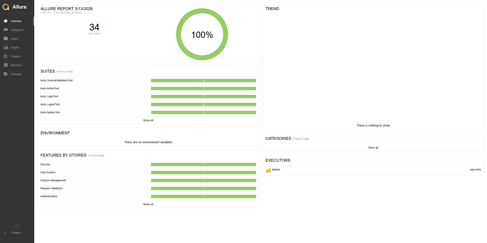

# AQA Test Project

API test suite for a Spring Boot application.
34 tests covering LOGIN / ACTION / LOGOUT / API Key validation.

## Stack

- Java 17, JUnit 5, REST Assured, WireMock, Allure

## Run locally

1. Place `internal-0.0.1-SNAPSHOT.jar` in the project root
2. Start the app:
   java -jar -Dsecret=qazWSXedc -Dmock=http://localhost:8888/ internal-0.0.1-SNAPSHOT.jar
3. Run tests:
   mvn clean test
4. Open report:
   mvn allure:serve

## Run in Docker

1. Place `internal-0.0.1-SNAPSHOT.jar` in the project root
2. docker compose up --build
3. Open report:
   cd target/site/allure-maven-plugin
   python -m http.server 8000
   → http://localhost:8000

## Test coverage

| Suite                 | Tests |
| --------------------- | ----- |
| LoginTest             | 7     |
| ActionTest            | 7     |
| LogoutTest            | 6     |
| ApiKeyTest            | 5     |
| GeneralValidationTest | 9     |

## Report preview

## Findings

During test development, a discrepancy was found between the documented
token format and the actual validation logic.
See [Issue #1](../../issues/1) for details.
